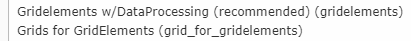

.. include:: ../../Includes.txt

=============
Basic configuration
=============

For a basically usage with Bootstrap v4 you don't need much configuration.

Static Template
===============

Include following static templates:

