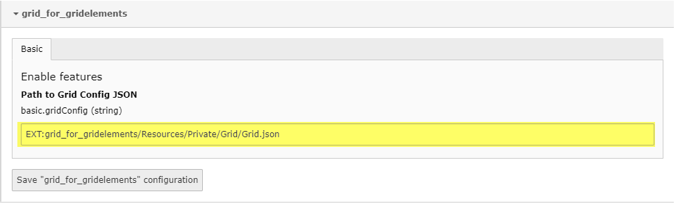

.. include:: ../../Includes.txt

==============================
Custom Framework configuration
==============================

If you don't use Bootstrap v4 or you need to customize the prepared grid ratio then you have to change the grid.json file.
Following steps will describe how to do it.

Copy Grid.json
^^^^^^^^^^^^^^

Copy the Grid.json to your resources folder. The Grid.json is located in: *Resources/Private/Grid/Grid.json*

Make your changes
^^^^^^^^^^^^^^^^^

Make your changes in your own Grid.json file. 

.. important:: Please note that the main structure remains the same.

.. code-block:: json

    {
        "cols": [
            {
			"onecol": [
                {
                "label": "",
                "class": [
                    "",
                    ""
                ]
                }
            ],
            "twocol": [
                {
                "label": "",
                "class": [
                    "",
                    ""
                ]
                }
            ],
            "threecol": [
                {
                "label": "",
                "class": [
                    "",
                    "",
                    ""
                ]
                }
            ],
            "fourthcol": [
                {
                "label": "",
                "class": [
                    "",
                    "",
                    "",
                    ""
                ]
                }
            
            ]
            }
        ],
        "row": [
            {
            "class": ""
            }
        ]
    }

Change extension settings
^^^^^^^^^^^^^^^^^^^^^^^^^
The next step will be change the path of Grid.json in the extension settings. 
This you will find in TYPO3 backend. 

Clear cache
^^^^^^^^^^^

Clear all cache and be happy with your customized grid