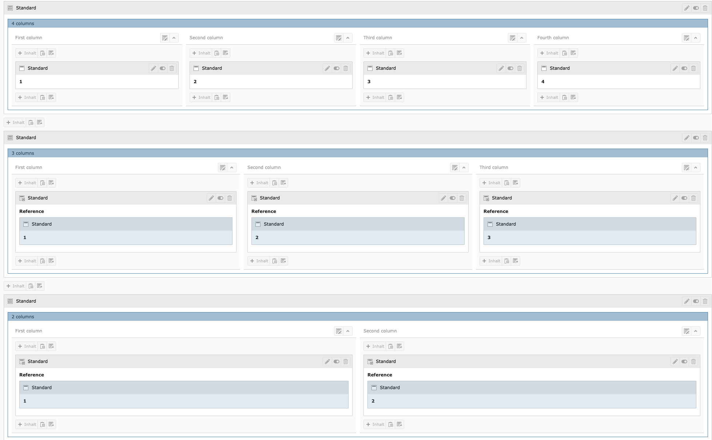
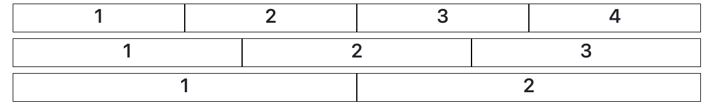

.. include:: ../Includes.txt

.. _introduction:

============
Introduction
============

.. _what-it-does:

What does it do?
================

This extension will add an easy to use grid with GridElements. It's Framework independent. 
It means you can config this extension with other Frameworks like Bootstrap, Foundation, ...
This version is prepared for Bootstrap v4.

.. _features:

Features
========
As a TYPO3 you have to choose between thre grid options:

- 2 column grid
- 3 column grid
- 4 column grid

Regarding the framework configuration you can choose for example between:

- 50%/50%
- 25%/75%
- 75%/25%

layouts in a 2 column grid.

.. _screenshots:

Screenshots
===========

Backend view

Frontend view

